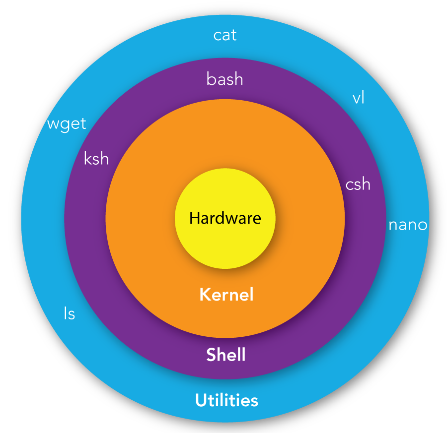
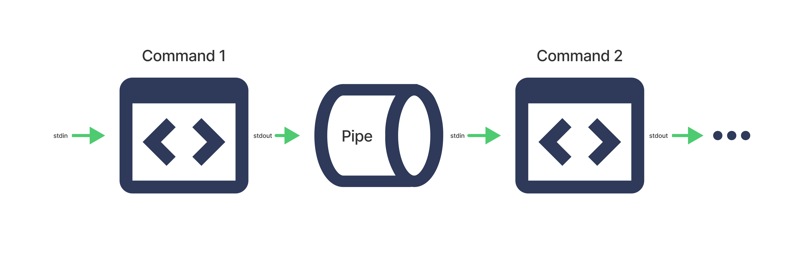

# Entorno Linux

**Índice de contenidos:**

- [¿Qué es Linux?](#qué-es-linux)
- [¿Qué es una Shell?](#qué-es-una-shell)
  - [Tipos de Shells en Linux](#tipos-de-shells-en-linux)
  - [¿Qué es el prompt de la shell?](#qué-es-el-prompt-de-la-shell)
  - [Historial de comandos](#historial-de-comandos)
  - [Metacaracteres comunes en la shell](#metacaracteres-comunes-en-la-shell)
- [Variables de entorno del sistema operativo Linux](#variables-de-entorno-del-sistema-operativo-linux)
  - [¿Qué es una variable?](#qué-es-una-variable)
  - [¿Qué es una variable de entorno?](#qué-es-una-variable-de-entorno)
  - [Variables de entorno comunes en Linux](#variables-de-entorno-comunes-en-linux)
  - [`|` (pipe)](#-pipe)
  - [`less`](#less)
  - [`echo`](#echo)
  - [Crear variable de entorno temporal](#crear-variable-de-entorno-temporal)
  - [Declarar una variable de entorno con un valor específico](#declarar-una-variable-de-entorno-con-un-valor-específico)
  - [Eliminar una variable de entorno](#eliminar-una-variable-de-entorno)
  - [Variables de entorno en inicio de sesión](#variables-de-entorno-en-inicio-de-sesión)

## ¿Qué es Linux?

**Linux** es un sistema operativo de código abierto basado en Unix.

Es ampliamente utilizado en **servidores**, **computadoras personales**, **dispositivos móviles** y **sistemas embebidos** debido a su estabilidad, seguridad y flexibilidad.

## ¿Qué es una Shell?

Una **Shell** es una interfaz de usuario que permite interactuar con el sistema operativo. Puede ser de dos tipos:

- **Interfaz de línea de comandos (CLI)**: Permite ingresar comandos de texto para realizar tareas.
- **Interfaz gráfica de usuario (GUI)**: Proporciona una interfaz visual para interactuar con el sistema.

Cuando hablamos de **Shell** en el contexto de Linux, generalmente nos referimos a la **CLI**. El _shell_ interpreta los comandos que el usuario ingresa y los ejecuta en el sistema operativo.

Casi todas las distribuciones de Linux utilizan **Bash** (Bourne Again SHell) como la _shell_ predeterminada, aunque existen otras opciones como Zsh, Fish, entre otras.



La _shell_ puede interpretar comandos:

- **internos**: comandos que forman parte de la propia _shell_.
- **externos**: programas o scripts almacenados en el sistema de archivos.

### Emuladores de Terminal

Un **emulador de terminal** es una aplicación que proporciona una interfaz de línea de comandos dentro de un entorno gráfico. Algunos ejemplos populares de emuladores de terminal en Linux son:

- GNOME Terminal
- Konsole
- xterm
- Terminator

Aunque es problable que se llame simplemente "Terminal" en el menú de aplicaciones.

Todos hacen lo mismo: permiten al usuario interactuar con la _shell_ del sistema operativo a través de una ventana gráfica.

### Tipos de Shells en Linux

| Shell    | Descripción                                              |
| -------- | -------------------------------------------------------- |
| **Sh**   | Bourne Shell, la shell original de Unix.                 |
| **Bash** | Bourne Again Shell, la más común en Linux.               |
| **Zsh**  | Z Shell, conocida por sus características avanzadas.     |
| **Csh**  | C Shell, similar a la sintaxis de C.                     |
| **Tcsh** | Una versión mejorada de C Shell (csh).                   |
| **Ksh**  | Korn Shell, combina características de Bourne y C Shell. |
| **Fish** | Friendly Interactive Shell, fácil de usar y configurar.  |

### ¿Qué es el prompt de la shell?

El **prompt** de la shell es el indicador que muestra que la shell está lista para recibir comandos.

Suele incluir información como:

- el nombre del usuario
- el nombre del host
- el directorio actual

Seguido del signo de dólar `$` (para usuarios normales) o del símbolo de almohadilla `#` (para el usuario root).

```bash
usuario@maquina:/ruta~$    # para usuario normal
usuario@maquina:~#         # para root
```

El prompt puede ser personalizado para mostrar diferentes colores, símbolos o información adicional según las preferencias del usuario.

Si estamos en una sesión Linux y queremos salir de la misma, podemos utilizar el comando `exit` o presionar `Ctrl + D`.

### Historial de comandos

La _shell_ mantiene un **historial de comandos** que registra los comandos que hemos ejecutado previamente. Podemos navegar por este historial utilizando las teclas de flecha arriba y abajo.

La mayoría de distribuciones Linux recuerdan los últimos 1000 comandos ejecutados, pero este número puede variar según la configuración del sistema.

### Metacaracteres comunes en la shell

| Metacaracter | Descripción                                                                  | Ejemplo                      |
| ------------ | ---------------------------------------------------------------------------- | ---------------------------- |
| `#`          | Indica un comentario.                                                        | `# Esto es un comentario`    |
| `;`          | Separa múltiples comandos en una sola línea.                                 | `cd /home; ls`               |
| `*`          | Coincide con cero o más caracteres.                                          | `ls *.txt`                   |
| `?`          | Coincide con un solo carácter.                                               | `ls file?.txt`               |
| `\`          | Escapa el siguiente carácter, tratándolo como literal.                       | `echo "Hola\ Mundo"`         |
| " "          | Agrupa texto y permite espacios dentro de cadenas. Evalúa metacaracteres.    | `echo "Hola Mundo"`          |
| ' '          | Agrupa texto y permite espacios dentro de cadenas. No evalúa metacaracteres. | `echo 'Hola $USER'`          |
| `~`          | Representa el directorio home del usuario actual.                            | `cd ~`                       |
| `$`          | Indica una variable.                                                         | `echo $HOME`                 |
| `>`          | Redirige la salida estándar a un archivo.                                    | `echo "Hola" > archivo.txt`  |
| `>>`         | Redirige la salida estándar y añade al final de un archivo.                  | `echo "Hola" >> archivo.txt` |
| `<`          | Redirige la entrada estándar desde un archivo.                               | `sort < archivo.txt`         |

**Diferencia entre comillas dobles y simples:**

```bash
$ USER="usuario"
$ echo "Hola $USER"   # Salida: Hola usuario
$ echo 'Hola $USER'   # Salida: Hola $USER
```

> Los metacaracteres de redirección (`>`, `>>`, `<`) se explican en más detalle en la sección de ["Comandos de redirección"](./3-comandos-basicos-linux.md#comandos-de-redireccion).

## Tipos de usuarios en Linux

| Tipo de usuario                                   | Descripción                                                                                                                                    |
| ------------------------------------------------- | ---------------------------------------------------------------------------------------------------------------------------------------------- |
| **Usuario normal**                                | Usuario con permisos limitados para tareas diarias.<br>Puede iniciar sesión, ejecutar aplicaciones y acceder a archivos y directorios propios. |
| **Usuario con permisos de superusuario _(sudo)_** | Usuario normal que puede usar `sudo` para tareas administrativas ocasionales sin tener que estar siempre en el modo de superusuario.           |
| **Root _(superusuario)_**                         | Usuario con privilegios administrativos completos.<br>Tiene control total sobre el sistema.                                                    |
| **Usuario especial**                              | Usuarios creados para servicios específicos (como `www-data` para servidores web).<br>No suelen iniciar sesión directamente.                   |

## Gestor de paquetes

Un **gestor de paquetes** es una herramienta que facilita la instalación, actualización, configuración y eliminación de software en un sistema operativo.

Cada distribución de Linux utiliza su propio gestor de paquetes:

- **Debian/Ubuntu**: `apt` o `apt-get`
- **Fedora**: `dnf`
- **CentOS/RHEL**: `yum`
- **Arch Linux**: `pacman`

Ejemplo de uso de `apt` para instalar un paquete:

```bash
sudo apt install nombre_paquete      # Instala el paquete especificado
sudo apt search termino_busqueda     # Busca paquetes relacionados con el término especificado
sudo apt list --installed            # Lista todos los paquetes instalados en el sistema

sudo apt-get update                  # Actualiza la lista de paquetes disponibles
sudo apt-get upgrade                 # Actualiza todos los paquetes instalados a sus últimas versiones
sudo apt-get remove nombre_paquete   # Elimina el paquete especificado
sudo apt-get purge nombre_paquete    # Desinstala el paquete y elimina sus archivos de configuración
```

|  `APT`  | `APT-GET` | `APTITUDE` |
| :-----: | :-------: | :--------: |
| install |  install  |  install   |
| upgrade |  upgrade  |  upgrade   |
|    -    |  update   |   update   |
|    -    |  remove   |   remove   |
|  purge  |   purge   |   purge    |
| search  |     -     |   search   |
|  list   |     -     |     -      |

`aptitude`:

- Se tiene que instalar con `sudo apt install aptitude`.
- Versión mejorada de `apt-get` con una interfaz de usuario basada en texto.
- Al eliminar un paquete, elimina las dependencias que ya no son necesarias.
- Antes de hacer cualquier cosa, siempre pregunta.

## Variables en Linux

### ¿Qué es una variable?

Una **variable** es un espacio en la memoria que almacena un valor que puede cambiar durante la ejecución de un programa o sesión.

### ¿Qué es una variable de entorno?

Una **variable de entorno** es una variable **dinámica** que afecta el comportamiento de los procesos en un sistema operativo. Son utilizadas por el sistema y las aplicaciones para obtener información sobre la configuración del entorno en el que se están ejecutando.

Podemos:

- Crear crear nuevas variables de entorno.
- Modificar el valor de las variables existentes.
- Eliminar variables de entorno.
- Listar todas las variables de entorno disponibles.

### Listar variables de entorno

Para **ver la lista de variables de entorno** podemos usar el comando:

```bash
printenv
```

o

```bash
env
```

La salida son todas las variables de entorno asociadas a la sesión del usuario. Ejemplo:

```bash
USER=usuario
HOME=/home/usuario
PATH=/usr/local/sbin:/usr/local/bin:/usr/sbin:/usr/bin:/sbin:/bin
SHELL=/bin/bash
```

### Listar todas las variables (entorno y shell)

Muestra todas las variables disponibles en el shell actual, incluyendo las variables de entorno y las variables locales que **solo existen dentro de esa sesión del shell**.

> Para las variables de entorno del sistema, usaremos `printenv` o `env`.

```bash
set
```

Como puede incluir mucha información, puedes canalizar el resultado por ejemplo con `head` para ver solo las primeras líneas:

```bash
set | head -4
```

Ejemplo de salida:

```bash
BASH=/bin/bash
BASHOPTS=cmdhist:complete_fullquote:extquote:force_fignore:histappend:interactive_comments:login_shell:progcomp:promptvars
BASH_ALIASES=()
BASH_ARGC=()
```

### Variables de entorno vs Variables de shell

| Característica    | Variables de entorno                                 | Variables de shell                  |
| ----------------- | ---------------------------------------------------- | ----------------------------------- |
| **Ámbito**        | Disponibles para el shell y procesos hijos           | Disponibles solo en el shell actual |
| **Creación**      | `export NOMBRE_VARIABLE="valor"`                     | `NOMBRE_VARIABLE="valor"`           |
| **Visualización** | `printenv NOMBRE_VARIABLE` o `echo $NOMBRE_VARIABLE` | `echo $NOMBRE_VARIABLE`             |
| **Eliminación**   | `unset NOMBRE_VARIABLE`                              | `unset NOMBRE_VARIABLE`             |

## Variables de entorno comunes en Linux

| Variable   | Descripción                                              | Valor de ejemplo                                               |
| ---------- | -------------------------------------------------------- | -------------------------------------------------------------- |
| `PATH`     | Lista de directorios donde el sistema busca ejecutables. | `/usr/local/sbin:/usr/local/bin:/usr/sbin:/usr/bin:/sbin:/bin` |
| `HOME`     | Directorio personal del usuario actual.                  | `/home/usuario`                                                |
| `USER`     | Nombre del usuario actual.                               | `usuario`                                                      |
| `SHELL`    | Ruta del intérprete de comandos predeterminado.          | `/bin/bash`                                                    |
| `PWD`      | Directorio de trabajo actual.                            | `/home/usuario`                                                |
| `LANG`     | Configuración regional y de idioma.                      | `es_ES.UTF-8`                                                  |
| `TERM`     | Tipo de terminal utilizado.                              | `xterm-256color`                                               |
| `EDITOR`   | Editor de texto predeterminado.                          | `nano`                                                         |
| `LOGNAME`  | Nombre de inicio de sesión del usuario.                  | `usuario`                                                      |
| `HOSTNAME` | Nombre del host del sistema.                             | `maquina`                                                      |
| `RANDOM`   | Número aleatorio generado por el sistema.                | `123456789`                                                    |

## Comandos relacionados con variables de entorno

### `|` _(pipe)_

El símbolo `|` (pipe) se utiliza para **encadenar** comandos.

Esto permite que la salida de un comando se convierta en la entrada de otro comando, facilitando la creación de flujos de trabajo más complejos y eficientes.



Por ejemplo:

```bash
ls -l | grep "archivo.txt"
```

Esto lista los archivos en formato largo y luego filtra la salida para mostrar solo las líneas que contienen "archivo.txt".

### `less`

- **Visualiza** el contenido de archivos de texto de forma paginada.
- Permite desplazarse por el contenido del archivo hacia adelante y hacia atrás (útil para archivos grandes).

Para ver la salida de las variables de entorno paginada:

```bash
printenv | less
```

### `echo`

- **Imprime** texto o el valor de variables en la terminal.
- Es útil para mostrar mensajes o resultados de comandos.

```bash
echo "Hola, mundo!"
```

```bash
echo $HOME
```

## Crear variable de entorno temporal con un valor específico

Es válida solo durante la sesión actual.

```bash
export NOMBRE_VARIABLE="valor"
```

```bash
export RUTA_PROYECTO="/home/usuario/proyecto"
```

Para mostrar el valor de la variable creada podemos usar `printenv` o `echo`:

```bash
printenv RUTA_PROYECTO
/home/usuario/proyecto
```

```bash
echo $RUTA_PROYECTO  # carácter $ delante del nombre de la variable
/home/usuario/proyecto
```

### Eliminar una variable de entorno

```bash
unset NOMBRE_VARIABLE
```

```bash
printenv NOMBRE_VARIABLE
# No mostrará nada si la variable ha sido eliminada
```

> [!NOTE]
> Los cambios en las variables de entorno de esta manera son **temporales** y solo afectan a la **sesión** que mantenga el usuario.

### Variables de entorno en inicio de sesión

#### Con inicio de sesión (autenticación login/password)

- Se cargan variables de entorno desde archivos como
  - `~/.bash_profile`
  - `~/.bash_login`
  - `~/.profile`.
- Estas variables están disponibles para todas las sesiones iniciadas por el usuario.

#### Sin inicio de sesión

- Sesión definida como _shell_ sin inicio de sesión.
  - _Por ejemplo, al abrir una terminal desde un entorno gráfico._
- Se cargan variables de entorno desde archivos como `~/.bashrc`.
- Estas variables están disponibles solo para sesiones interactivas sin inicio de sesión.
- Los shells **no interactivos** leen la variable de entorno `BASH_ENV` para cargar un archivo específico.
