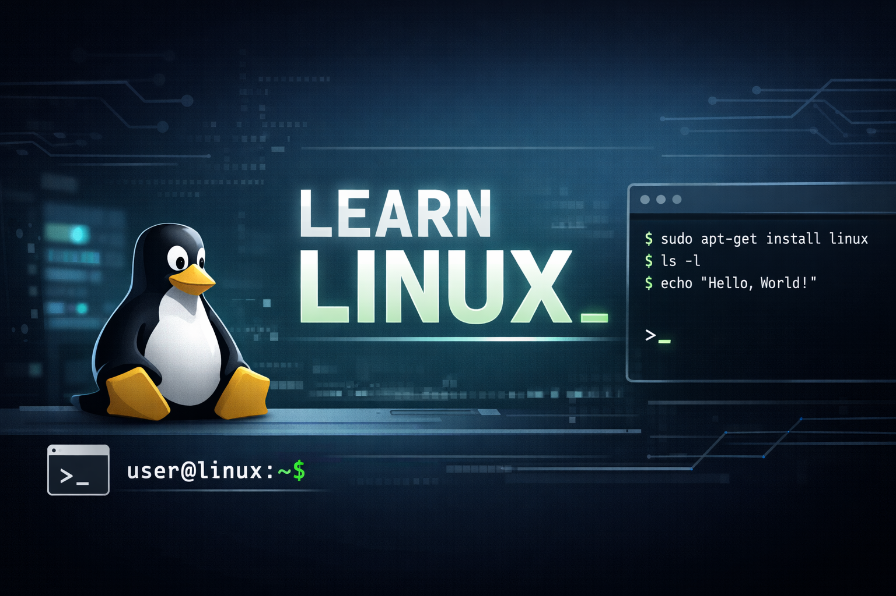

 

    
    
    
    

# Aprende Linux desde cero

- **Comandos básicos de Linux**
  - [Entorno Linux](1-comandos-basicos/1-entorno-linux.md)
  - [Sistema de archivos](1-comandos-basicos/2-sistema-de-archivos.md)
  - [Comandos básicos de Linux](1-comandos-basicos/3-comandos-basicos-linux.md)
  - [Ejercicios prácticos](1-comandos-basicos/4-ejercicios.md)
- **Gestión de usuarios y permisos**
  - [Usuario root y comandos básicos](2-gestion-usuarios-y-grupos-permisos/1-usuario-root-y-comandos-basicos.md)
  - [Gestión de grupos](2-gestion-usuarios-y-grupos-permisos/2-gestion-grupos.md)
  - [Gestión de usuarios](2-gestion-usuarios-y-grupos-permisos/3-gestion-usuarios.md)
  - [Permisos en Linux](2-gestion-usuarios-y-grupos-permisos/4-gestion-permisos.md)
  - [Ejercicios prácticos](2-gestion-usuarios-y-grupos-permisos/5-ejercicios.md)
- **Gestión de redes en Linux**
  - [Conceptos básicos de redes](3-redes/1-conceptos-basicos-redes.md)
  - [Configuración de red en Linux](3-redes/2-configuracion-red-linux.md)
  - [Ejercicios prácticos](3-redes/3-ejercicios.md)
- **Gestión de procesos**
  - [Procesos en Linux](4-procesos/1-procesos-linux.md)
  - [Ejercicios prácticos](4-procesos/2-ejercicios.md)
- **Shell scripting**
  - [Introducción al shell scripting](5-shell-scripting/1-shell-scripting-basics.md)

## Recursos para aprender Linux

- [Linux Journey](https://linuxjourney.com/)
- [Linux Your Mind](https://lym.readthedocs.io/en/latest/index.html)
- [The Linux Command Line](http://linuxcommand.org/tlcl.php)
- [Linux Kernel Documentation](https://www.kernel.org/doc/html/latest/)
